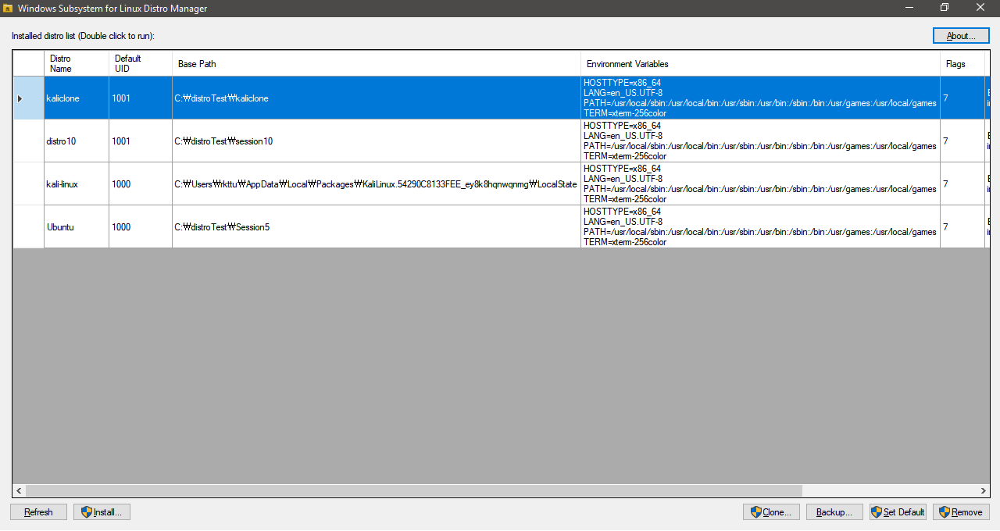

# WSL-DistroManager

WSL-DistroManager is a highly customizable WSL distro manager for Windows 10 and Windows Server 2016 (or later).

This program helps you install and manage multiple versions of the same Linux distribution on the Windows Subsystem for Linux. This program is currently under development and may take some time to complete its first function.

The goal of this project is to get parameters from the CLI and install any Linux package (install.tar.gz) with the specified name.

After receiving the code, I will actively review the issues and the problems that appear after the test.

This project follows the MIT license.

## Build Instruction

This repository does not provide `intall.tar.gz` file. You can download the `install.tar.gz` file from [this page](https://docs.microsoft.com/en-us/windows/wsl/install-on-server) manually.

